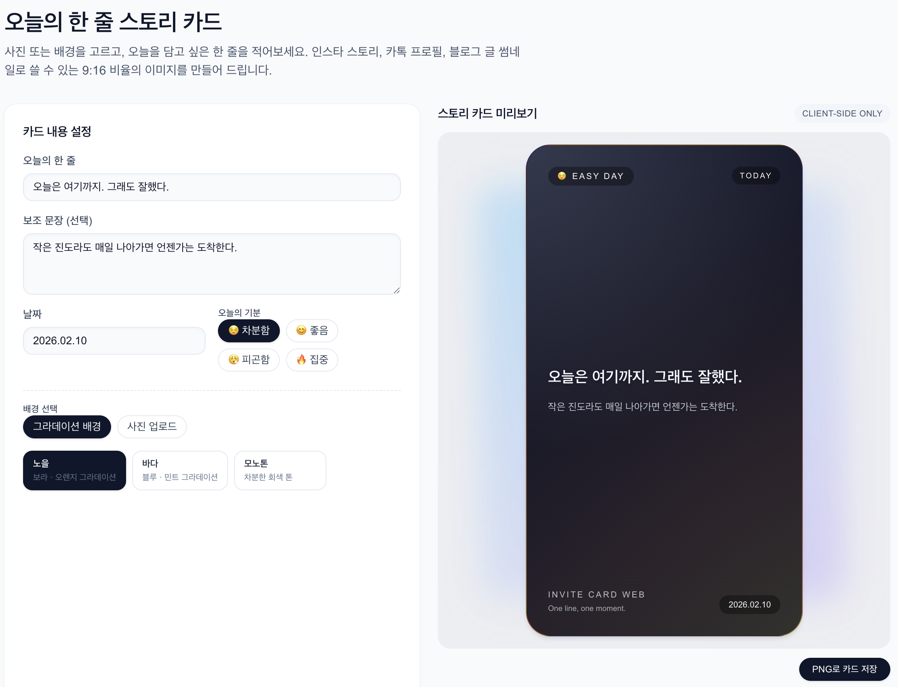

## StoryShot – 오늘의 한 줄 인스타 스토리 카드 생성기

StoryShot은 **사진 + 텍스트로 인스타 스토리/카카오톡 프로필/블로그 썸네일에 쓰기 좋은 9:16 카드**를 만드는 개인 사이드 프로젝트입니다.

- **Live**: https://storyshot.vercel.app/
- **Stack**: Next.js (App Router), React, TypeScript, Tailwind CSS v4

예시 썸네일(OG 이미지):



---

### 주요 기능

- **오늘의 한 줄 / 보조 문장 입력**
  - 메인 문장 + 서브 문장을 입력해서 한 장짜리 스토리 카드 생성
- **기분 선택**
  - 😌 차분함 / 😊 좋음 / 😮‍💨 피곤함 / 🔥 집중 등의 간단한 기분 토글
- **배경 선택**
  - 그라데이션 템플릿 3종 (노을/바다/모노톤)
  - 사용자 사진 업로드 후, 위에 텍스트를 얹어서 카드 생성
- **9:16 비율 미리보기**
  - 인스타 스토리/모바일 화면 비율에 맞는 카드 미리보기
- **PNG 다운로드**
  - html-to-image 를 사용해 카드 영역을 PNG 파일(`story-card.png`)로 저장
  - 저장한 이미지를 그대로 인스타/카톡/블로그 등에 업로드해서 사용 가능

모든 동작은 **클라이언트 사이드에서만 수행**되며, 업로드한 이미지/입력한 텍스트는 서버에 저장되지 않습니다.

---

### SEO 및 메타데이터 설정

#### 1. 기본 메타데이터 (`src/app/layout.tsx`)

- `Metadata`를 이용해 기본 SEO 정보를 설정했습니다.
  - `title`: `"StoryShot – 오늘의 한 줄 인스타 스토리 카드 생성기"`
  - `description`: 인스타 스토리/카카오톡/블로그 썸네일 용도 중심으로 작성
  - `keywords`: `"StoryShot", "스토리샷", "인스타 스토리 카드", "오늘의 한 줄" 등`
  - `alternates.canonical`: `/`
  - `robots.index = true`, `robots.follow = true`
- Open Graph / Twitter 카드
  - `og:image`, `twitter:image` 모두 `"/og-card.png"` 를 사용
  - `public/og-card.png` 로 정적 썸네일 이미지를 배치

#### 2. robots 설정 (`src/app/robots.ts`)

```ts
export default function robots(): MetadataRoute.Robots {
  const baseUrl = process.env.NEXT_PUBLIC_SITE_URL ?? "https://storyshot.vercel.app";

  return {
    rules: {
      userAgent: "*",
      allow: "/",
    },
    sitemap: `${baseUrl}/sitemap.xml`,
  };
}
```

- 모든 크롤러에 대해 전체 경로 크롤링 허용
- `Sitemap: https://storyshot.vercel.app/sitemap.xml` 을 명시

#### 3. sitemap 설정 (`src/app/sitemap.ts`)

```ts
export default function sitemap(): MetadataRoute.Sitemap {
  const baseUrl = process.env.NEXT_PUBLIC_SITE_URL ?? "https://storyshot.vercel.app";

  return [
    {
      url: `${baseUrl}/`,
      lastModified: new Date(),
      changeFrequency: "weekly",
      priority: 1,
    },
  ];
}
```

- 현재 단일 페이지 구조라 루트(`/`)만 포함
- 배포 후 `/sitemap.xml` 경로로 자동 노출

#### 4. Google Search Console 소유권 인증

- HTML 파일 방식 인증을 사용했습니다.
- `public/googleaffbcddc16034708.html`:

```text
google-site-verification: googleaffbcddc16034708.html
```
- 배포 후 `https://storyshot.vercel.app/googleaffbcddc16034708.html` 에 접근 가능  
  → GSC에서 HTML 파일 방식으로 소유권 확인

---

### Analytics & 광고 수익화 설정

#### 1. Google Analytics 4 연동

- GA4 데이터 스트림(웹) 생성 후 발급받은 **측정 ID (`G-XXXX...`)** 를 사용했습니다.
- `NEXT_PUBLIC_GA_MEASUREMENT_ID` 환경 변수를 통해 ID를 주입합니다.
- `src/app/layout.tsx`에서 `next/script`를 사용해 gtag를 초기화합니다.

```ts
const gaId = process.env.NEXT_PUBLIC_GA_MEASUREMENT_ID;

export default function RootLayout({ children }: { children: React.ReactNode }) {
  return (
    <html lang="ko">
      <body>
        {gaId && (
          <>
            <Script
              src={`https://www.googletagmanager.com/gtag/js?id=${gaId}`}
              strategy="afterInteractive"
            />
            <Script id="ga-init" strategy="afterInteractive">
              {`
                window.dataLayer = window.dataLayer || [];
                function gtag(){dataLayer.push(arguments);}
                gtag('js', new Date());
                gtag('config', '${gaId}');
              `}
            </Script>
          </>
        )}
        {children}
      </body>
    </html>
  );
}
```

- 기본 **페이지뷰/세션/기본 이벤트**를 수집하며, 향후 필요 시 `gtag('event', 'download_card', {...})` 형태로 커스텀 이벤트를 추가해 행동 단위 트래킹이 가능합니다.

#### 2. Google AdSense 연동

- AdSense 사이트 등록 및 `ca-pub-...` 퍼블리셔 ID를 사용해 전역 스크립트를 로드합니다.
- 서명 메타 태그:

```ts
export const metadata: Metadata = {
  // ...
  other: {
    "google-adsense-account": "ca-pub-8116400352006173",
  },
};
```

- 전역 스크립트는 `next/script`로 한 번만 로드합니다.
- 광고 배너용 재사용 컴포넌트(`src/components/AdBanner.tsx`)를 만들어 페이지 어디에서나 간단히 삽입 가능합니다.

```tsx
export function AdBanner({ adSlot }: { adSlot: string }) {
  useEffect(() => {
    if (!adSlot || adSlot.startsWith("REPLACE_")) return;
    (window.adsbygoogle = window.adsbygoogle || []).push({});
  }, [adSlot]);

  return (
    <div className="min-h-[90px] w-full rounded-xl bg-slate-100/80">
      <ins
        className="adsbygoogle"
        style={{ display: "block" }}
        data-ad-client="ca-pub-8116400352006173"
        data-ad-slot={adSlot}
        data-ad-format="auto"
        data-full-width-responsive="true"
      />
    </div>
  );
}
```

- 실제 운영 시에는 AdSense에서 발급된 **광고 단위 슬롯 ID** 를 `adSlot`에 전달하여 배너를 노출합니다.

---

### 로컬 개발

```bash
pnpm install
pnpm dev
# 또는
npm install
npm run dev
```

- 기본 포트: `http://localhost:3000`

---

### 사용 흐름 (요약)

1. **오늘의 한 줄 / 보조 문장 입력**
2. 날짜 + 오늘의 기분 선택
3. 그라데이션 배경 또는 사진 업로드 선택
4. 우측 미리보기에서 9:16 스토리 카드 확인
5. `PNG로 카드 저장` 버튼으로 이미지 다운로드
6. 인스타 스토리 / 카카오톡 프로필 / 블로그 썸네일 등에 업로드해서 사용

면접/리뷰어 관점에서는:

- **순수 프론트엔드(무백엔드)** 환경에서
  - 이미지 업로드/렌더링
  - 카드 레이아웃/애니메이션/다운로드
  - SEO/OG/robots/sitemap/GSC 설정까지
- 한 번에 경험해볼 수 있는 작은 완결형 프로젝트라는 점을 봐주시면 좋을 것 같습니다.

This is a [Next.js](https://nextjs.org) project bootstrapped with [`create-next-app`](https://nextjs.org/docs/app/api-reference/cli/create-next-app).

## Getting Started

First, run the development server:

```bash
npm run dev
# or
yarn dev
# or
pnpm dev
# or
bun dev
```

Open [http://localhost:3000](http://localhost:3000) with your browser to see the result.

You can start editing the page by modifying `app/page.tsx`. The page auto-updates as you edit the file.

This project uses [`next/font`](https://nextjs.org/docs/app/building-your-application/optimizing/fonts) to automatically optimize and load [Geist](https://vercel.com/font), a new font family for Vercel.

## Learn More

To learn more about Next.js, take a look at the following resources:

- [Next.js Documentation](https://nextjs.org/docs) - learn about Next.js features and API.
- [Learn Next.js](https://nextjs.org/learn) - an interactive Next.js tutorial.

You can check out [the Next.js GitHub repository](https://github.com/vercel/next.js) - your feedback and contributions are welcome!

## Deploy on Vercel

The easiest way to deploy your Next.js app is to use the [Vercel Platform](https://vercel.com/new?utm_medium=default-template&filter=next.js&utm_source=create-next-app&utm_campaign=create-next-app-readme) from the creators of Next.js.

Check out our [Next.js deployment documentation](https://nextjs.org/docs/app/building-your-application/deploying) for more details.
